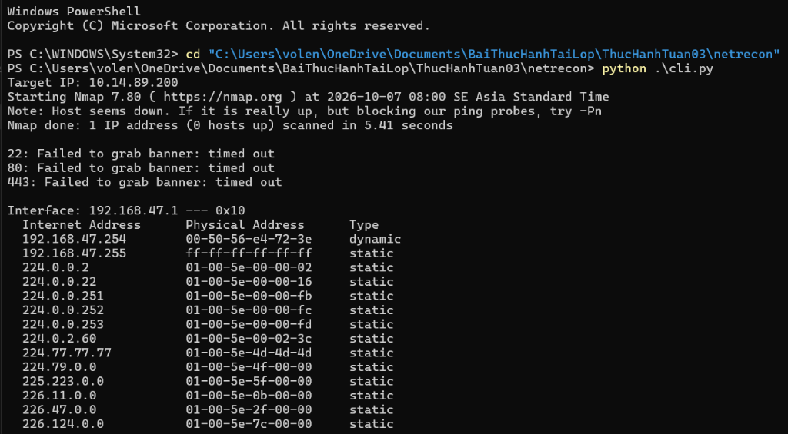
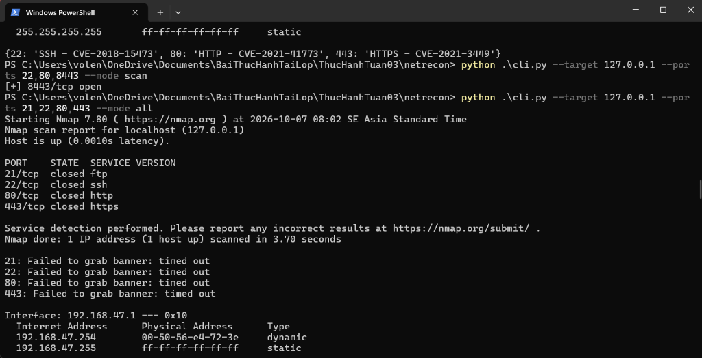
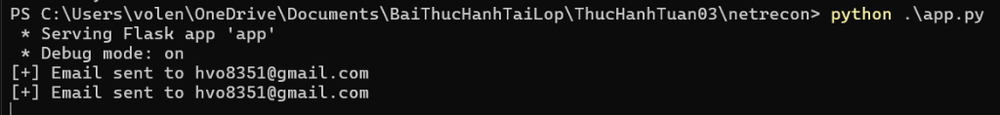
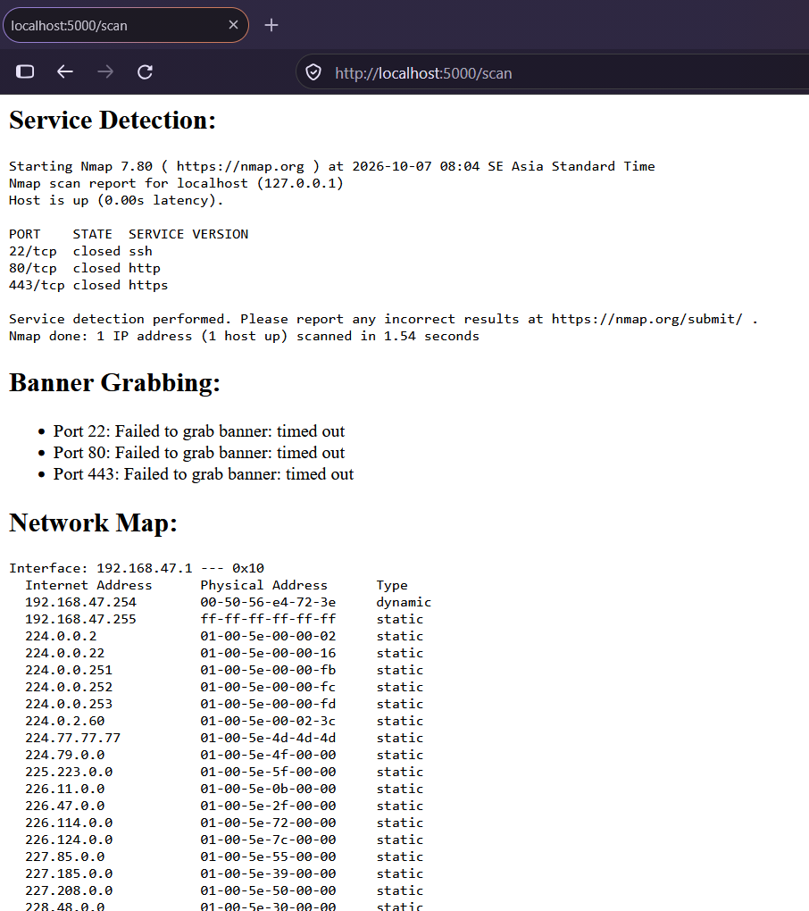
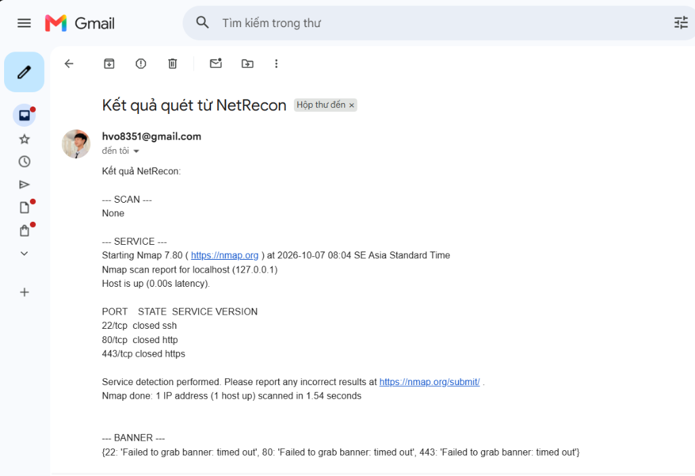

### Họ và Tên: Võ Lê Nhật Hoàng
### MSSV: 2387700017
### Lớp: 23DATA1
# BÀI 3: BẢO MẬT MẠNG MÁY TÍNH (SECURE SOCKET SSL/TLS & TRINH SÁT MẠNG)

---

## 1. Giới thiệu chung
Bài thực hành số 3 trang bị kiến thức và kỹ năng thực tiễn về bảo mật mạng máy tính thông qua hai chủ đề cốt lõi:
1. **Phần 1 – Ứng dụng Chat Bảo mật ([`secure-chat/`](./secure-chat/README.md))**:
   - Lập trình socket an toàn với **SSL/TLS 1.2+** và xác thực chứng chỉ số hai chiều (**mTLS**) bằng hạ tầng CA tự xây dựng với **OpenSSL**.
   - Tích hợp mã hóa tin nhắn đầu-cuối bằng thuật toán đối xứng **AES-256-CBC** (`PKCS7 padding`), quản lý kết nối và phòng chat đa luồng an toàn.
2. **Phần 2 – Bộ công cụ Trinh sát & Khám phá mạng ([`netrecon/`](./netrecon/README.md))**:
   - Phát triển bộ công cụ **NetRecon** hỗ trợ cả giao diện dòng lệnh (**CLI**) và giao diện Web (**Flask**).
   - Tích hợp 5 kỹ thuật trinh sát: Quét cổng bất đồng bộ có giới hạn tốc độ (`PortScanner`), nhận dạng phiên bản dịch vụ với Nmap (`ServiceDetector`), thu thập banner (`BannerGrabber`), khám phá bảng ARP mạng nội bộ (`NetworkMapper`), kiểm tra lỗ hổng cơ bản (`VulnChecker`), lọc mục tiêu Whitelist/Blacklist và tự động gửi báo cáo qua Gmail SMTP.

---

## 2. Cấu trúc tổng thể Bài 3
```text
Bài 3/
├── secure-chat/                 # Phần 1: Ứng dụng Chat Bảo mật SSL/TLS & AES-256-CBC
│   ├── certs/                   # Chứng chỉ CA, Server, Client (được loại trừ khi push lên Git)
│   ├── openssl.cnf              # Cấu hình OpenSSL cho Root CA (v3_ca)
│   ├── make-certs.bat           # Script sinh khóa RSA 2048-bit và chứng chỉ X.509
│   ├── message_encryption.py    # Mã hóa / giải mã tin nhắn AES-256-CBC + PKCS7
│   ├── connection_manager.py    # Quản lý danh sách kết nối Client đa luồng
│   ├── room_manager.py          # Quản lý phòng chat đa luồng
│   ├── server.py                # Máy chủ SecureChatServer (127.0.0.1:8443)
│   ├── client.py                # Máy khách SecureChatClient
│   └── README.md                # Báo cáo chi tiết Phần 1
├── netrecon/                    # Phần 2: Bộ công cụ Trinh sát & Khám phá mạng NetRecon
│   ├── modules/                 # Các module chức năng (PortScan, Service, Banner, ARP, Vuln, Email, Filter)
│   ├── static/                  # CSS giao diện Web
│   ├── templates/               # HTML templates (layout, index, result)
│   ├── cli.py                   # Giao diện dòng lệnh (Click)
│   ├── app.py                   # Giao diện Web (Flask - cổng 5000)
│   ├── requirements.txt         # Thư viện phụ thuộc
│   ├── netrecon.log             # File log ghi nhận toàn bộ hoạt động kèm thời gian
│   └── README.md                # Báo cáo chi tiết Phần 2
├── images/                      # Hình ảnh minh chứng kết quả thực nghiệm
└── README.md                    # Tài liệu tổng quan Bài 3
```

---

## 3. Hình ảnh kết quả thực nghiệm

### 3.1. Phần 1: Ứng dụng Chat Bảo mật (`secure-chat`)

#### Tạo chứng chỉ số CA, Server và Client bằng `make-certs.bat`:


#### Khởi chạy `server.py` lắng nghe kết nối TLS tại `127.0.0.1:8443`:


#### Hai Client (`Hoang` và `Vo`) kết nối và trao đổi tin nhắn mã hóa đầu-cuối:


---

### 3.2. Phần 2: Bộ công cụ khám phá mạng (`netrecon`)

#### Kiểm thử giao diện dòng lệnh `cli.py` (chế độ tương tác và tham số `--mode scan`, `--mode all`):



#### Khởi chạy ứng dụng Web `app.py` và gửi email kết quả tự động:


#### Kết quả hiển thị trực quan trên giao diện Web (`http://localhost:5000/scan`):


#### Báo cáo kết quả quét nhận được trong hộp thư Gmail (`hvo8351@gmail.com`):


---

## 4. Quản lý bảo mật mã nguồn (Git Security)
- File `.gitignore` được cấu hình để loại trừ toàn bộ thông tin nhạy cảm trước khi đẩy lên GitHub:
  - `certs/` và `*.pem`: Ngăn chặn lộ khóa riêng tư (`ca.key`, `server.key`, `client.key`).
  - `.env`: Ngăn chặn lộ mật khẩu ứng dụng Gmail (`SMTP_PASS`).
  - `gitsecure.log`, `__pycache__/`, `*.pyc`.
