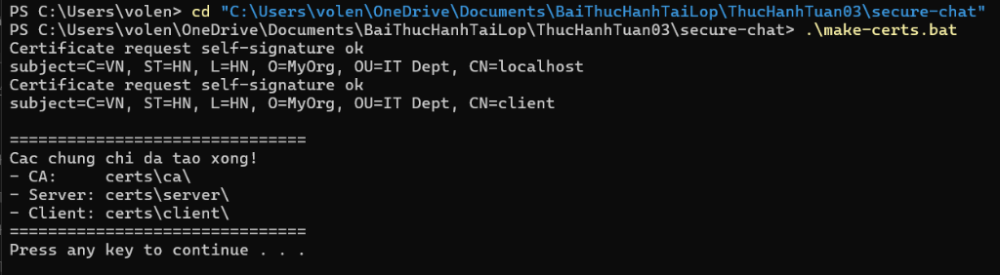
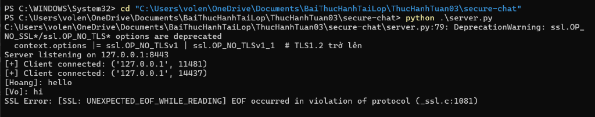
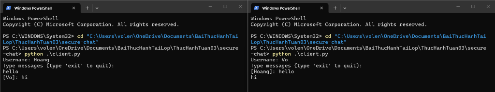

### Họ và Tên: Võ Lê Nhật Hoàng
### MSSV: 2387700017
### Lớp: 23DATA1
## BÀI 3 - PHẦN 1: SECURECHAT (ỨNG DỤNG CHAT BẢO MẬT VỚI SSL/TLS & MÃ HÓA ĐẦU-CUỐI)

---

## 1. Mục tiêu bài thực hành
- Nắm vững nguyên lý lập trình socket an toàn (Secure Socket) sử dụng giao thức **SSL/TLS** và cơ chế xác thực chứng chỉ số hai chiều (**Mutual TLS - mTLS**).
- Tự thiết lập hạ tầng khóa công khai (PKI) nội bộ bằng **OpenSSL** để phát hành chứng chỉ số cho Root CA, Server và Client.
- Xây dựng ứng dụng **SecureChat** đa luồng gồm:
  - `SecureChatServer`: Server đa luồng hỗ trợ SSL/TLS (từ TLS 1.2 trở lên) và bắt buộc xác thực chứng chỉ Client (`CERT_REQUIRED`).
  - `SecureChatClient`: Client xác minh chứng chỉ Server qua Root CA và tự động thương lượng khóa phiên mã hóa.
  - `MessageEncryption`: Mã hóa đầu-cuối (End-to-End / Per-Client Encryption) cho tin nhắn bằng thuật toán đối xứng **AES-256-CBC** kết hợp **PKCS7 Padding**.
  - `ConnectionManager` & `RoomManager`: Quản lý trạng thái kết nối và phân phối tin nhắn theo phòng chat an toàn đa luồng (`threading.Lock`).

---

## 2. Cấu trúc thư mục
```text
secure-chat/
├── certs/                       # Thư mục lưu trữ khóa và chứng chỉ X.509 (được loại trừ trong .gitignore)
│   ├── ca/
│   │   ├── ca.key               # Khóa riêng tư RSA 2048-bit của Root CA
│   │   ├── ca.crt               # Chứng chỉ số tự ký của Root CA (hiệu lực 10 năm)
│   │   └── ca.srl.bak           # File quản lý số serial của CA
│   ├── server/
│   │   ├── server.key           # Khóa riêng tư RSA 2048-bit của Server
│   │   ├── server.csr           # Yêu cầu ký chứng chỉ (CSR) của Server (CN=localhost)
│   │   └── server.crt           # Chứng chỉ Server được ký bởi Root CA (hiệu lực 1 năm)
│   └── client/
│       ├── client.key           # Khóa riêng tư RSA 2048-bit của Client
│       ├── client.csr           # Yêu cầu ký chứng chỉ (CSR) của Client (CN=client)
│       └── client.crt           # Chứng chỉ Client được ký bởi Root CA (hiệu lực 1 năm)
├── openssl.cnf                  # File cấu hình OpenSSL cho Root CA (extension v3_ca)
├── make-certs.bat               # Script tự động sinh toàn bộ khóa & chứng chỉ CA, Server, Client
├── message_encryption.py        # Module mã hóa và giải mã tin nhắn AES-256-CBC + PKCS7
├── connection_manager.py        # Module quản lý kết nối Client và khóa AES tương ứng
├── room_manager.py              # Module quản lý phòng chat đa luồng
├── server.py                    # Chương trình máy chủ SecureChatServer
├── client.py                    # Chương trình máy khách SecureChatClient
└── README.md                    # Tài liệu báo cáo chi tiết
```

---

## 3. Kiến trúc bảo mật 2 lớp (Dual-Layer Security Architecture)

Ứng dụng **SecureChat** bảo vệ dữ liệu truyền thông qua 2 lớp bảo mật độc lập:

```text
+-----------------------------------------------------------------------------------+
| LỚP 1: BẢO MẬT TẦNG GIAO VẬN (SSL/TLS 1.2+ & XÁC THỰC CHỨNG CHỈ HAI CHIỀU mTLS) |
|  - Server trình diện server.crt (CN=localhost) được ký bởi MyRootCA (ca.crt)      |
|  - Client trình diện client.crt (CN=client) được ký bởi MyRootCA (ca.crt)         |
|  - Cả hai bên bật ssl.CERT_REQUIRED -> Chống giả mạo (Spoofing) & MITM            |
+-----------------------------------------------------------------------------------+
                                         |
                                         v
+-----------------------------------------------------------------------------------+
| LỚP 2: MÃ HÓA BẢN TIN ỨNG DỤNG (AES-256-CBC + PKCS7 PADDING)                      |
|  - Mỗi Client tự sinh khóa đối xứng 256-bit (32 bytes) ngẫu nhiên bằng os.urandom |
|  - Mỗi tin nhắn sinh một vector khởi tạo IV 16 bytes ngẫu nhiên mới               |
|  - Cấu trúc gói tin: [16 bytes IV] + [AES-256-CBC Ciphertext]                     |
+-----------------------------------------------------------------------------------+
```

---

## 4. Cơ chế hoạt động của các thành phần

### 4.1. Khởi tạo chứng chỉ số (`openssl.cnf` & `make-certs.bat`)
- **Root CA (`ca.crt`)**: Được tạo với cấu hình extension `v3_ca` gồm `basicConstraints = critical, CA:true` và `keyUsage = critical, keyCertSign, cRLSign` nhằm đáp ứng tiêu chuẩn kiểm tra nghiêm ngặt X.509 (`VERIFY_X509_STRICT`) trên các phiên bản OpenSSL 3.x và Python hiện đại.
- **Server & Client Certificates**: Sinh khóa RSA 2048-bit, khởi tạo CSR và được ký xác nhận bởi khóa riêng của Root CA (`ca.key`) với thuật toán băm `SHA-256`.

### 4.2. Module `message_encryption.py` (`MessageEncryption`)
- **`encrypt(plaintext)`**:
  1. Sinh vector khởi tạo `iv = os.urandom(16)` (128-bit) duy nhất cho mỗi tin nhắn.
  2. Đệm dữ liệu đầu vào theo chuẩn `PKCS7(128)` để độ dài bản rõ là bội số của khối 16 bytes.
  3. Mã hóa bằng `Cipher(algorithms.AES(self.key), modes.CBC(iv))`.
  4. Trả về chuỗi byte ghép `iv + ct`.
- **`decrypt(ciphertext)`**:
  1. Tách 16 bytes đầu làm `iv` và phần còn lại làm `ct`.
  2. Giải mã bằng `AES-256-CBC` với khóa `self.key` và `iv`.
  3. Gỡ đệm (`PKCS7(128).unpadder()`) và giải mã chuỗi UTF-8.

### 4.3. Module `connection_manager.py` & `room_manager.py`
- Sử dụng `threading.Lock()` (Context Manager `with self.lock:`) để đồng bộ hóa truy cập khi nhiều luồng Client kết nối, ngắt kết nối hoặc gửi tin nhắn cùng lúc, tránh tình trạng Race Condition hay lỗi `RuntimeError: dictionary changed size during iteration`.

### 4.4. Luồng hoạt động của `server.py` và `client.py`
1. `server.py` khởi tạo `ssl.SSLContext(ssl.Purpose.CLIENT_AUTH)`, nạp chứng chỉ Server, nạp `ca.crt`, bật `ssl.CERT_REQUIRED` và vô hiệu hóa các phiên bản TLS cũ (`OP_NO_TLSv1`, `OP_NO_TLSv1_1`).
2. `client.py` kết nối tới `127.0.0.1:8443` qua kênh TLS, gửi thông tin định danh và khóa AES-256 ở dạng Hex (`username:key_hex`).
3. Khi một Client gửi tin nhắn đã mã hóa bằng khóa AES của mình, Server giải mã, gắn nhãn `[username]: message`, sau đó mã hóa lại riêng biệt theo khóa AES của từng Client khác trong phòng trước khi chuyển tiếp.

---

## 5. Hướng dẫn sử dụng & Kết quả thực nghiệm

### Bước 1: Sinh chứng chỉ số SSL/TLS
```powershell
cd secure-chat
.\make-certs.bat
```


### Bước 2: Khởi chạy Server
```powershell
python .\server.py
```


### Bước 3: Khởi chạy nhiều Client và trao đổi tin nhắn mã hóa
```powershell
python .\client.py
```

